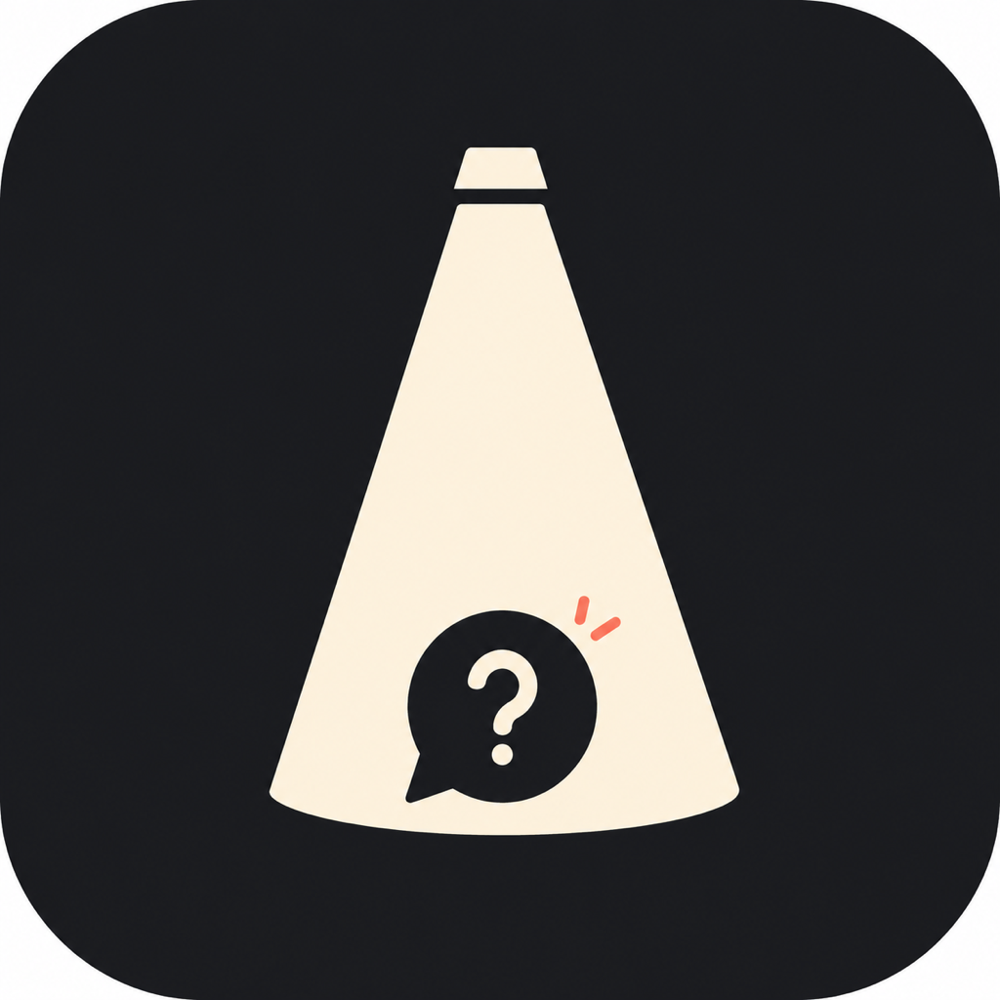
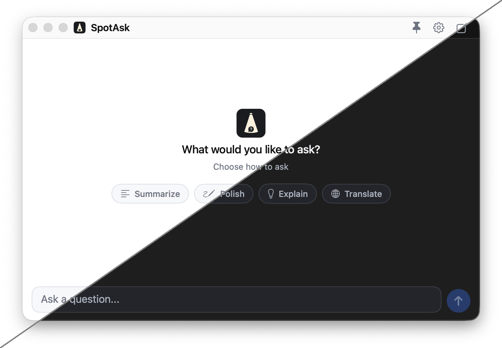
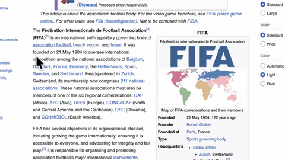

<p align="center">
  
</p>

<h1 align="center">SpotAsk</h1>

<p align="center">
  A native macOS menu-bar AI assistant. Quickly summon it with a hotkey to ask anything from anywhere, or select text in Safari, Notes, and other apps to translate, explain, summarize, or polish it — with your own AI service (BYOK).
</p>

<p align="center">
  <a href="https://github.com/shiquda/SpotAsk/releases/latest"></a>
  <a href="https://github.com/shiquda/SpotAsk/actions/workflows/ci.yml"></a>
  <a href="LICENSE"></a>
</p>

<p align="center">
  Native macOS app · Privacy-first · macOS 15+ · Apple silicon and Intel · AGPL-3.0
</p>

<p align="center">
  <a href="#download">Download</a> · <a href="#quick-start">Build from source</a> · <a href="#development">Development</a> · <a href="README.zh-CN.md">简体中文</a>
</p>

<p align="center">
  
</p>

## What SpotAsk does

- **Ask from anywhere** — press Option + Space (customizable) to open a focused chat window, ready for a question.
- **Select text in other apps** — highlight text in Safari, Notes, or other macOS apps; translate, explain, summarize, polish, or run a custom prompt from the quick action bar that appears next to your selection.
- **Switch models anytime** — change the model for the current conversation right from the window, without touching your default in Settings.
- **Ask with attachments** — paste a screenshot, or drop in images and text/code files; follow-up questions keep the earlier context.
- **Copy what you need** — grab the full answer or individual code blocks in one click.
- **Automate repeated tasks** — built-in prompts for translate, explain, summarize, and polish; create your own for repeated workflows.
- **Customize shortcuts** — choose a global hotkey preset or record your own shortcuts for chat, the selection assistant, and common actions.
- **8 interface languages** — English, 简体中文, Español, Deutsch, 日本語, Français, Português, Русский.
- **Work with macOS** — ask a question, start a new conversation, or run a prompt from Spotlight, Siri, or Shortcuts.

## Typical use cases

SpotAsk is built around two everyday flows. Watch how each one works before you start:

<table>
  <tr>
    <td width="50%" align="center"><strong>Quick chat</strong></td>
    <td width="50%" align="center"><strong>Ask about selected text</strong></td>
  </tr>
  <tr>
    <td width="50%" align="center"></td>
    <td width="50%" align="center"></td>
  </tr>
  <tr>
    <td width="50%" align="center">Press your hotkey (default Option + Space) to summon the chat window and ask anything.</td>
    <td width="50%" align="center">Select text in Safari, Notes, or other apps, then use the quick action bar to translate, explain, summarize, polish, or run a custom prompt.</td>
  </tr>
</table>

## Download

Download the matching package from [GitHub Releases](https://github.com/shiquda/SpotAsk/releases):

- **Apple silicon** — choose the `arm64` DMG for M-series Macs.
- **Intel** — choose the `x86_64` DMG for Intel Macs.

The packages are signed with a Developer ID and notarized by Apple, so macOS can verify them on first launch without a manual confirmation. The official release supports SpotAsk from Spotlight, Siri, or Shortcuts. To build a custom version instead, follow [Build with system integrations](#build-with-system-integrations).

## Quick start

You can also build SpotAsk from source.

**Requirements**

- macOS 15 or later
- Xcode 16 or later
- A service account that provides an OpenAI-compatible or Anthropic chat API

**Build and run**

```sh
./Scripts/make-app-bundle.sh
open build/SpotAsk.app
```

After launch, SpotAsk appears in your menu bar. The app has no Dock icon.

### Build with system integrations

The official release supports Spotlight, Siri, and Shortcuts. If you build a custom version, sign it with an Apple development team. A free Apple Account is sufficient for a personal build:

1. Open `SpotAsk.xcodeproj` in Xcode.
2. Select the SpotAsk target, then open **Signing & Capabilities**.
3. Choose your Personal Team under **Team** and keep **Automatically manage signing** enabled.
4. If Xcode reports that the bundle identifier is unavailable, change **Bundle Identifier** to a unique value.
5. Run the app from Xcode once before using its actions in Shortcuts.

Personal Team builds are intended for personal use and may need to be rebuilt periodically.

## First-run configuration

Open Settings from the menu bar (or press Cmd + ,) and fill in:

1. **Provider** — select the service you want to use (OpenAI-compatible or Anthropic), or add a new one.
2. **Service address** — the full chat endpoint URL for your provider.
3. **Model** — the model name your provider expects (for example, `gpt-5-mini`).
4. **Access key** — your service credential, stored only on this Mac.

Use **Test Connection** to confirm the values work, then close Settings and start asking.

## Everyday use

| Action | How |
| --- | --- |
| Open the chat window | Click the menu bar icon, or press your configured hotkey (default Option + Space) |
| Send a question | Type your question and press Return |
| Add a line break | Shift + Return |
| Stop generating | Press Escape, or click Stop |
| Copy an answer | Right-click the answer, or use the copy button |
| Copy a code block | Click the copy icon on any code block |
| Run a prompt on selected text | Select text in another app, then click an action in the quick action bar |
| Start a new conversation | Choose New Conversation from the menu bar |
| Use a prompt | With content in the input, select a prompt to send immediately. With an empty input, select one, enter your question, then press Return. |
| Open Settings | Click the menu bar icon and choose Settings, or press Cmd + , |

The window remembers its size and position across launches.

## Privacy

Privacy-first by design: SpotAsk is a native macOS app, your access key stays on this Mac, and your selected text is sent only to the service you configure.

Questions, custom instructions, and responses are sent to the service you configure. Review that provider's privacy and data-retention policies before handling sensitive information.

Your access key and settings stay on this Mac. When conversation retention is enabled, recent conversations are stored locally as well.

The selection assistant reads the text you select through the macOS Accessibility API. Permission is requested only when you enable the feature, and selected text is sent only to the service you configured.

## Development

Build, test, packaging, localization, and release instructions live in [DEVELOPMENT.md](DEVELOPMENT.md).

## License

SpotAsk is licensed under the [GNU AGPL v3](LICENSE).
