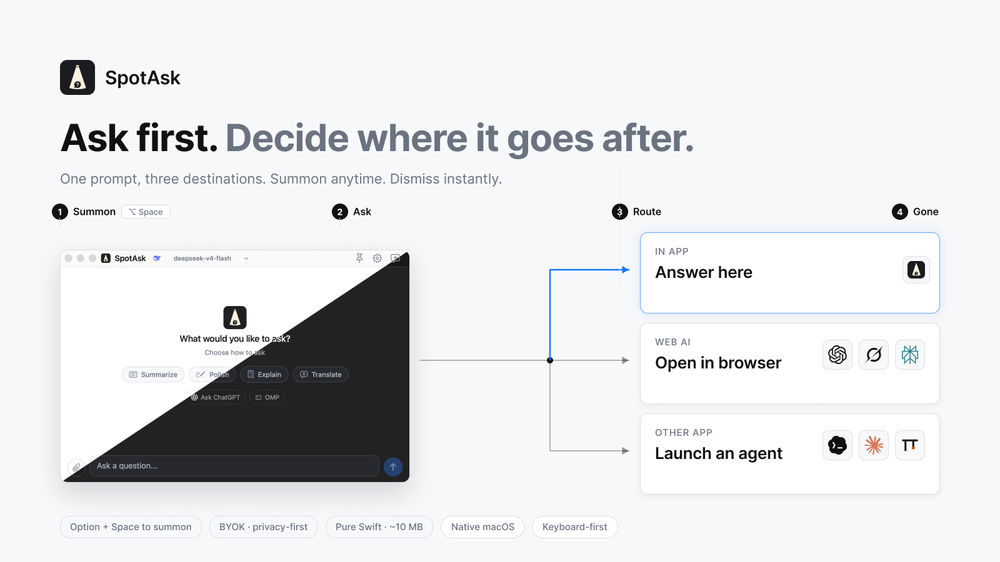

<p align="center">
  
</p>

<h1 align="center">SpotAsk</h1>

<p align="center">
  A native macOS menu-bar AI assistant & query router. Summon with a hotkey, get instant answers, or route anywhere in one click.
</p>

<p align="center">
  <a href="https://github.com/shiquda/SpotAsk/releases/latest"></a>
  <a href="https://github.com/shiquda/SpotAsk/actions/workflows/ci.yml"></a>
  <a href="LICENSE"></a>
</p>

<p align="center">
  <a href="#download">Download</a> · <a href="#highlights">Highlights</a> · <a href="https://shiquda.github.io/SpotAsk/">Documentation</a> · <a href="#quick-start">Quick start</a> · <a href="#build-from-source">Build from source</a> · <a href="README.zh-CN.md">简体中文</a>
</p>

## Highlights

- **Instant hotkey capture, dismiss anytime** — Press `⌥ + Space` (customizable) to summon a focused input window anywhere; stream answers using your own API key (BYOK), then tap `Esc` to close without breaking stride.
- **1-click query routing (External Ask)** — Hand off questions to external tools without consuming API tokens or cluttering history:
  - **Web AI**: Launch queries directly in ChatGPT, Perplexity, Grok, and more.
  - **CLI agents**: Wake up local command-line agents (like omp) directly in Terminal.
  - **Desktop apps**: Trigger installed apps and note-taking tools via custom URI schemes.
- **Global selection assistant** — Highlight text in Safari, Xcode, or Notes to trigger an inline action bar; send text directly into chat for follow-up, or translate, explain, summarize, and polish in place.
- **Multimodal & attachments** — Paste screenshots or drop in images, text, and code files; multi-turn conversations seamlessly retain context.
- **Prompt presets** — Built-in templates for daily workflows, with custom prompt creation and dedicated shortcuts.
- **Pure native & lightweight** — Built entirely with Swift and AppKit; ~10 MB installer, zero Electron runtime, instant cold-starts, and minimal memory footprint.
## Workflows in action

SpotAsk is built around two simple ideas: **"Ask first. Decide where it goes after."** and **"Summon anytime. Dismiss instantly."** — keeping everyday AI interactions fast, keyboard-first, and zero-friction.

### 1. Hotkey summoning: Ask and dismiss

Press the global hotkey (default `⌥ + Space`) to summon a focused question window, get a streaming answer, and press `Esc` when you are done.
<p align="center">
  
</p>

### 2. Selection assistant & External routing

<table>
  <tr>
    <td width="50%" align="center"><strong>Work with selected text</strong></td>
    <td width="50%" align="center"><strong>1-click external routing (External Ask)</strong></td>
  </tr>
  <tr>
    <td width="50%" align="center"></td>
    <td width="50%" align="center"></td>
  </tr>
  <tr>
    <td width="50%" align="center">Highlight text anywhere to translate, explain, polish, or bring directly into chat.</td>
    <td width="50%" align="center">Press a shortcut to route questions to local CLI agents (e.g. omp) or web AI platforms without spending API tokens.</td>
  </tr>
</table>

## Download

Install with Homebrew:

```sh
brew tap shiquda/spotask https://github.com/shiquda/SpotAsk
brew install --cask shiquda/spotask/spotask
```

Or download the matching package from [GitHub Releases](https://github.com/shiquda/SpotAsk/releases):

- **Apple silicon** — choose the `arm64` DMG for M-series Macs.
- **Intel** — choose the `x86_64` DMG for Intel Macs.

The packages are signed with a Developer ID and notarized by Apple for a seamless first launch.

## Quick start

1. **Configure provider**: Open Settings (`⌘ + ,`), choose **Services**, and add your OpenAI-compatible or Anthropic endpoint, model ID, and API key.
2. **Test connection**: Click **Test Connection** to verify your credentials.
3. **Start asking**: Press `⌥ + Space` anywhere to summon SpotAsk and type your first question!

## Key shortcuts

| Action | Shortcut | Notes |
| --- | --- | --- |
| Summon / Dismiss window | `⌥ + Space` | Global hotkey, customizable in Settings |
| Selection action bar | `⌥ + ⇧ + Space` | Trigger actions near highlighted text |
| Dismiss / Stop generating | `Esc` | Instant close with zero friction |
| New conversation | `⌘ + N` | Clear conversation history |
| Open Settings | `⌘ + ,` | Configure providers, shortcuts, and appearance |

> For full shortcut mapping and detailed options, see the [Settings & Shortcuts Reference](https://shiquda.github.io/SpotAsk/reference).

## Privacy

- **BYOK (Bring Your Own Key)**: Access keys are stored securely in macOS Keychain and sent only to your configured provider.
- **Zero telemetry**: No account required, no middle proxy servers, and no tracking.
- **On-demand permissions**: The selection assistant requests Accessibility permissions only when enabled, and reads text strictly when you highlight it.

## Build from source

**Requirements**: macOS 15+, Xcode 16+.

```sh
./Scripts/install-debug-app.sh
```

SpotAsk Debug will appear in your menu bar with an isolated app identity that does not interfere with production releases.

### System integrations

Official releases support Spotlight, Siri, and Shortcuts. For custom builds, sign the target with your Personal Team in Xcode.

## Documentation & Development

- [Online Documentation](https://shiquda.github.io/SpotAsk/): Complete user guide, provider setup, selection actions, and troubleshooting.
- [Developer Guide](DEVELOPMENT.md): Instructions for building, testing, localization, and releases.
## License

SpotAsk is licensed under the [GNU AGPL v3](LICENSE).
