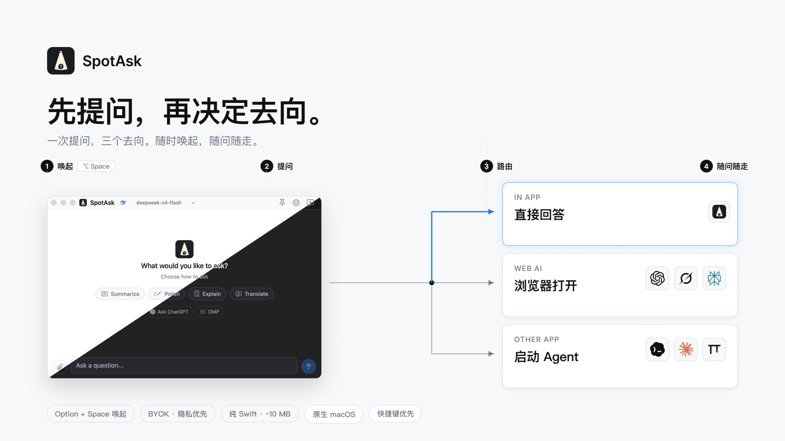

<p align="center">
  
</p>

<h1 align="center">SpotAsk</h1>

<p align="center">
  原生 macOS 菜单栏 AI 助手与分流工具：一个快捷键随时呼出，问完再决定交给谁。
</p>

<p align="center">
  <a href="https://github.com/shiquda/SpotAsk/releases/latest"></a>
  <a href="https://github.com/shiquda/SpotAsk/actions/workflows/ci.yml"></a>
  <a href="LICENSE"></a>
</p>

<p align="center">
  <a href="#下载安装">下载安装</a> · <a href="#核心特性">核心特性</a> · <a href="https://shiquda.github.io/SpotAsk/zh-CN/">在线文档</a> · <a href="#快速上手">快速上手</a> · <a href="#从源码构建">从源码构建</a> · <a href="README.md">English</a>
</p>

## 核心特性

- **全局快捷呼出，即问即走** — 随时按 `⌥ + Space`（可自定义）唤出专注小窗；直连你的模型密钥（BYOK）流式作答，按 `Esc` 立即退出，不打断手头节奏。
- **多向一键分流 (External Ask)** — 写完问题直接派发至外部目的地，不消耗 API 额度，不残留多余历史：
  - **网页端 AI**：直接唤起 ChatGPT、Perplexity、Grok 等展开深度搜索。
  - **终端 CLI Agent**：一键在 macOS 终端中唤醒本地命令行 Agent（如 omp）。
  - **桌面应用**：通过自定义 URI 协议触发本地工具或笔记软件。
- **全局划词助手** — 在 Safari、Xcode、备忘录等任意应用中划词，浮动操作条就近浮现；可一键填入对话追问，或直接翻译、总结、解释与润色。
- **多模态与附件支持** — 直接粘贴截图或拖入图片、代码和文本文档，多轮对话自动保留上下文。
- **常用提示词预设** — 内置高频生产力模板，支持快速自定义与专属快捷键绑定。
- **纯原生轻量体验** — 纯 Swift + AppKit 打造，安装包仅约 10 MB，无 Electron 运行时；毫秒级冷启动，静默常驻菜单栏，内存占用极低。
## 工作流演示

SpotAsk 围绕 **“先提问再分流（Ask first. Decide where it goes after.）”** 与 **“随时唤起，随问随走（Summon anytime. Dismiss instantly.）”** 构建——让日常 AI 交互轻量、键盘优先且无多余心智负担。

### 1. 快捷呼出，即问即走

按全局快捷键（默认 `⌥ + Space`）唤出窗口，输入问题即可获得流式解答，按 `Esc` 即可退出。
<p align="center">
  
</p>

### 2. 全局划词与外部路由

<table>
  <tr>
    <td width="50%" align="center"><strong>全局划词即刻处理</strong></td>
    <td width="50%" align="center"><strong>一键外部路由 (External Ask)</strong></td>
  </tr>
  <tr>
    <td width="50%" align="center"></td>
    <td width="50%" align="center"></td>
  </tr>
  <tr>
    <td width="50%" align="center">在任意应用中选中文本，直接翻译、解释、润色，或带入对话追问。</td>
    <td width="50%" align="center">按快捷键将问题直派本地终端 Agent（如 omp）或网页端 AI，不耗自身 Token。</td>
  </tr>
</table>

## 下载安装

通过 Homebrew 安装：

```sh
brew tap shiquda/spotask https://github.com/shiquda/SpotAsk
brew install --cask shiquda/spotask/spotask
```

或从 [GitHub Releases](https://github.com/shiquda/SpotAsk/releases) 下载对应架构的 DMG：

- **Apple Silicon** — M 系列芯片请下载 `arm64` 安装包。
- **Intel** — Intel 芯片请下载 `x86_64` 安装包。

官方发布包已使用 Apple Developer ID 签名并经公证，首次运行无需繁琐确认。
## 快速上手

1. **配置服务**：打开设置（`⌘ + ,`）进入服务页，选择或添加你的服务商（OpenAI 兼容或 Anthropic），填写 API 地址、模型 ID 与访问密钥。
2. **测试连接**：点击“测试连接”确认配置无误。
3. **开始提问**：按 `⌥ + Space` 呼出窗口，键入你的第一个问题！

## 常用快捷键

| 操作 | 快捷键 | 说明 |
| --- | --- | --- |
| 唤起 / 关闭提问窗口 | `⌥ + Space` | 全局快捷键，可在设置中自定义 |
| 划词操作栏 | `⌥ + ⇧ + Space` | 选中文字后呼出浮动操作条 |
| 退出窗口 / 停止生成 | `Esc` | 一键关闭，不留多余打扰 |
| 开始新对话 | `⌘ + N` | 清空当前对话流 |
| 打开设置 | `⌘ + ,` | 配置模型、外观与快捷键 |

> 更多快捷键与详细配置请查看[设置与快捷键参考](https://shiquda.github.io/SpotAsk/zh-CN/reference)。

## 隐私承诺

- **BYOK 自带密钥**：访问密钥加密保存在 macOS 本地钥匙串中，只在发起请求时直连你配置的 AI 服务商。
- **零中转零收集**：没有账号系统、没有中心服务器、没有任何遥测监控。
- **权限严格按需**：划词助手仅在开启时申请 macOS 辅助功能权限，仅用于读取你主动选中的文字。

## 从源码构建

**环境要求**：macOS 15+，Xcode 16+。

```sh
./Scripts/install-debug-app.sh
```

构建完成后，SpotAsk Debug 会常驻于菜单栏中，使用独立的 App Identity，不影响正式版配置与权限。

### 启用系统联动

官方发布版本支持 Spotlight、Siri 和快捷指令。自行构建版本如需使用快捷指令联动，只需在 Xcode 中使用个人证书（Personal Team）完成签名即可。

## 文档与开发

- [在线用户手册](https://shiquda.github.io/SpotAsk/zh-CN/)：涵盖完整配置指南、服务接入、划词规则与故障排查。
- [开发者指南](DEVELOPMENT.md)：包含完整构建、测试、本地化与版本发布流程。
## 许可证

SpotAsk 使用 [GNU AGPL v3](LICENSE) 许可证。
