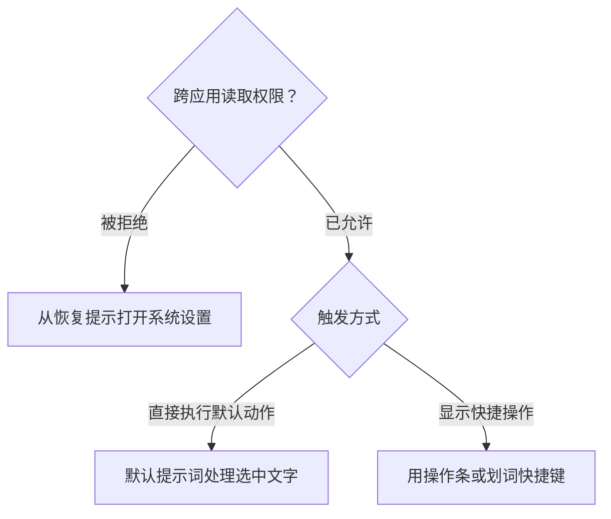

# 划词助手

划词助手会读取你在其他应用中选中的文字，并交给 SpotAsk 执行翻译、解释、总结、润色或自定义提示词。

## 开启功能

1. 打开设置 > **划词助手**。
2. 开启“划词助手”。
3. 按提示允许“跨应用读取权限”。
4. 选择“触发方式”。

SpotAsk 只在你开启该功能时申请权限。该权限用于读取你主动选中的文字，不会监控整个屏幕。

<SpotAskSettingsLink section="selection-assistant" />

## 触发方式

**直接执行默认动作**会把选中文字直接发送给默认提示词。

**显示快捷操作**会在选区旁边显示操作条。你也可以选择在图标旁显示文字。

- **填入对话图标**：动作栏最左侧提供一个对话气泡图标。点击后会呼出提问窗口，将选中的文字填入输入框并在末尾留出空行，方便直接追加追问。可以在设置 > **划词助手**中单独开关（默认开启）。
- 内置提示词、自定义提示词与已启用的外部提问目标紧随其后排列在操作条中。
## 自动显示

在“显示快捷操作”模式下，开启“选中文字后自动显示快捷操作”，可以不用每次都按快捷键。

使用“自动显示范围”控制显示位置：

- **所有应用**：在能够提供选中文字的任意应用中显示。
- **白名单**：只在所选应用中显示。
- **黑名单**：不在所选应用中显示。

默认等待 0.8 秒。你可以在 0 到 3 秒之间调整“等待时间”，避免选择尚未结束时操作条就出现。

## 手动触发

即使关闭自动显示，也可以使用划词快捷键手动触发。默认是 `⌥ + ⇧ + Space`。

## 可能遇到的问题

- 空选区不会触发 SpotAsk。
- 安全输入区域无法读取。
- 部分应用不会向 macOS 辅助功能暴露选中文字，SpotAsk 会提示这种情况。
- 如果权限被拒绝，应用会显示恢复提示并链接到系统设置。

相关：[提示词](/zh-CN/guides/prompts)、[故障排查](/zh-CN/troubleshooting)
